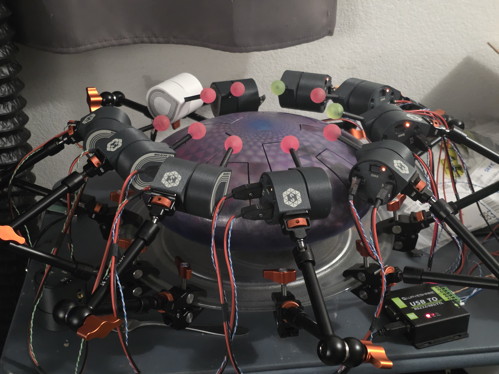
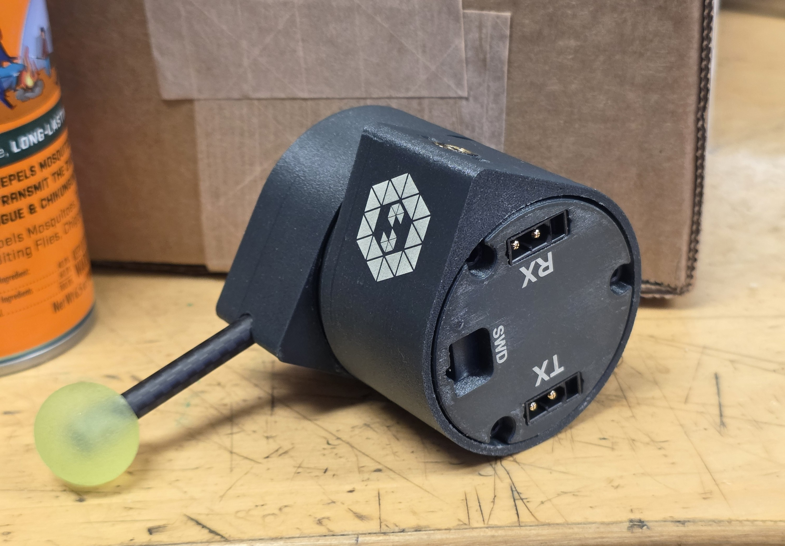
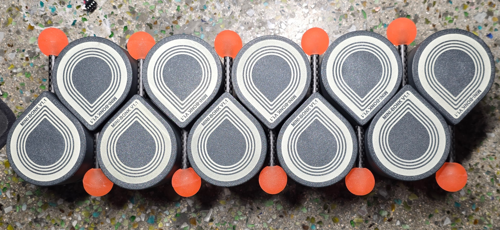
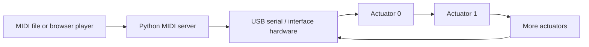

# BL4818 Brushless Servo Musical Actuator

This repository contains the electronics, embedded firmware, host software,
and browser players for a network of brushless servo percussion actuators.
The actuators use modified BL4818 motor-controller hardware, a Nuvoton M2003
microcontroller, hall sensing, and an MT6701 absolute encoder to move a mallet
with controlled timing and force.

The system is in active use: roughly 35 actuators have been built, and the
firmware plus MIDI player/server are working well. The software is much closer
to production-ready than the replication documentation, so this repository
should currently be treated as a proven project under documentation rather
than a turn-key kit.



## What the actuators look like

Each self-contained actuator packages the modified BL4818 motor controller,
absolute encoder, power/data interface, and mallet mechanism inside the printed
shell. RX and TX connectors allow power and serial data to continue through the
actuator chain, while the recessed SWD port provides programming access.

| Connector and programming end | Completed actuator bodies and mallets |
| --- | --- |
|  |  |

## System overview



The Python server owns the serial port and serves the browser UI. It enumerates
the actuator ring, maps MIDI pitches to actuator addresses, schedules strikes,
and compensates for measured mechanical latency. Each actuator closes its own
current, velocity, and position loops and runs the homing/strike state machine.
The current protocol uses a four-bit address and supports up to 16 actuators per
ring.

## What is in this repository

- `src/` and `include/`: M2003 bare-metal firmware.
- `scripts/`: ring-bus client, MIDI server, tuning, measurement, and demo tools.
- `player/`: browser-based MIDI player, looper, and tongue-drum player.
- `pcb/`: KiCad electronics plus current mechanical/fabrication exports.
- `mechanical/`: SolidWorks source CAD and STEP exports for the actuator shell,
  mallet holder, and interface-board reference model.
- `docs/`: replication notes, hardware references, debug history, and design notes.
- `protocol.md`: byte-level Ring Bus Protocol v2 specification.
- `midi_server_api.md`: HTTP API for integrations and custom players.

See [Repository map](docs/repository-map.md) for a guided tour.

## Quick software start

The supported development path is currently Windows. The firmware Makefile
expects GNU Make and the Arm GNU toolchain in `PATH`; the flash scripts expect a
SEGGER J-Link and PowerShell.

### 1. Install host dependencies

Install Python 3.10 or newer, then from the repository root run:

```powershell
py -m venv .venv
.\.venv\Scripts\Activate.ps1
py -m pip install -r requirements.txt
```

### 2. Build the firmware

Install `arm-none-eabi-gcc` and GNU Make, then run:

```powershell
make
```

The main output is `build/m2003-motor.bin`. To also generate the J-Link command
file:

```powershell
powershell -File scripts/build-jlink.ps1
```

### 3. Flash an actuator

Connect the programmer over SWD and run:

```powershell
powershell -File scripts/flash-jlink.ps1
```

The script builds, flashes, and verifies the application image when J-Link
readback is available. Disconnect motor power while changing wiring or
attaching the programmer; a servo actuator can move unexpectedly during
bring-up.

### 4. Start the MIDI player

Connect the interface serial port to a powered actuator ring and run:

```powershell
py scripts/ring_midi_server.py -p COM7 --library-dir C:\path\to\midi-library
```

Open <http://localhost:8765/>. Enumerate the ring, home the actuators, and assign
a MIDI pitch to each slot before playing a file. The mapping is stored locally
in `mapping.json` and is intentionally not committed.

For a first hardware check without the browser:

```powershell
py scripts/ring_tool.py -p COM7 enumerate
py scripts/ring_tool.py -p COM7 status 0
```

Run `py scripts/ring_tool.py --help` for the complete command list.

## Documentation

- [Replication guide](docs/replication-guide.md): staged path from hardware to a playing ring.
- [Hardware guide](docs/hardware.md): current BL4818 modification and actuator assembly architecture.
- [Firmware guide](docs/firmware.md): architecture, build, flash, and module boundaries.
- [Host software guide](docs/host-software.md): server, browser players, and bench tools.
- [Replication status](docs/replication-status.md): what is reproducible now and what still needs source material.
- [Ring Bus Protocol v2](protocol.md): serial packet and command specification.
- [MIDI server HTTP API](midi_server_api.md): integration API.
- [Design decisions](Decisions.md) and [debug log](DebugLog.md): engineering history.

## Replication status and safety

The repository does not yet contain enough verified information for a new
builder to safely reproduce the complete actuator without assistance. In
particular, power-system limits, connector pinouts, a released BOM, mechanical
assembly dimensions, and a photographed bring-up procedure still need to be
documented. Those gaps are tracked explicitly in
[Replication status](docs/replication-status.md); unknown values are not guessed
in the guides.

This project drives a fast moving mechanism at several amps. Use a current-
limited supply during bring-up, keep hands and instruments clear of the mallet,
provide a physical power disconnect, and test one actuator before assembling a
ring.

## License

No project-wide license has been selected yet. Until one is added, the source
is visible for evaluation but normal open-source reuse permissions have not
been granted. A license should be chosen before presenting the repository as a
fully replicable open-source project; third-party code under `CMSIS/`,
`Library/`, and `RTT/` retains its own notices and terms.
